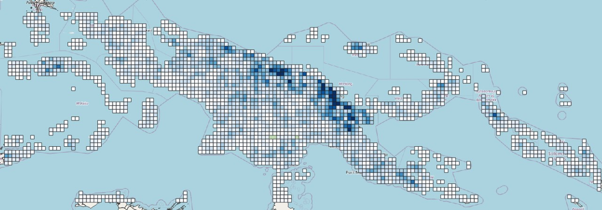
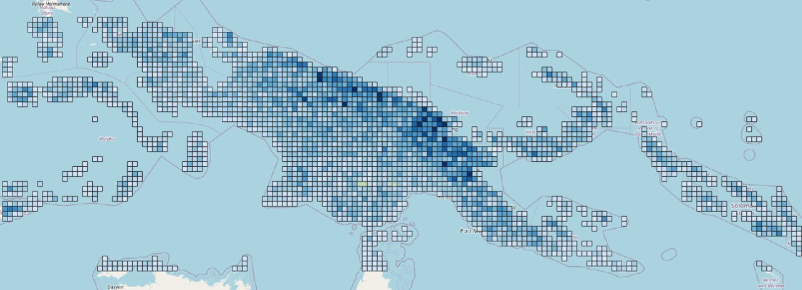
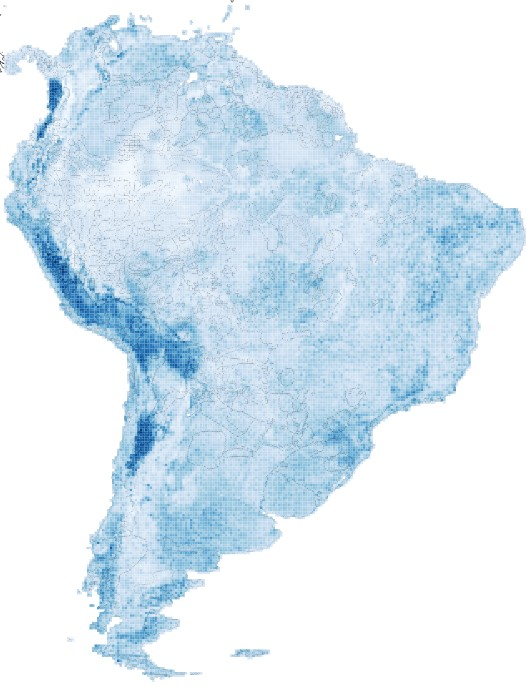

# linguistics_learning

## Overview

This project provides a comprehensive framework for training various machine learning models, including CNN classifiers, regressors from scikit-learn, and segmentation models. The framework is designed with flexibility in mind, allowing for dynamic configuration of architectures, datasets, and evaluation methods.


<div style="text-align: center;">          <p style="font-style: italic; font-size: 14px;">Figure 1: Annotations of language diversity in Papa New Guinea</p> </div>

<div style="text-align: center;">          <p style="font-style: italic; font-size: 14px;">Figure 2: Test predictions of language diversity in Papa New Guinea</p> </div>

<div style="text-align: center;">          <p style="font-style: italic; font-size: 14px;">Figure 3: Raster prediction of langauge diversity in South America. Results from south_america_train_80_val_20_2024-08-21.gpkg</p> </div>

## Installation

To get started, clone the repository and install the necessary dependencies by running:

```
pip install -r requirements.txt
```

## Model Architectures

This project leverages a variety of model architectures tailored for different tasks:

- **CNN (Convolutional Neural Networks):**
  The primary CNN architecture used in this project is based on **ResNet18**, a widely adopted model known for its deep residual learning capabilities.
- **Segmentation:**
  For segmentation tasks, a **Custom U-Net** model is implemented, enhanced with APS (Anti-aliasing Pooling and Striding) as described in [this repository](https://github.com/achaman2/truly_shift_invariant_cnns). This implementation improves segmentation consistency, addressing issues related to shift invariance.
- **Regression:**
  The regression models in this project include **Random Forest** and **Linear Regression** algorithms, both from the scikit-learn library. These models are well-suited for various regression tasks, offering a balance between interpretability and predictive power.

## Usage

### Notebooks

To facilitate experimentation and data preparation, several Jupyter notebooks are provided in the `./notebooks` directory.

- **Training Data Preparation:**
  Use the `notebooks/walkthrough.ipynb` notebook to download and prepare the training data required for your models. This notebook walks you through the process step-by-step, ensuring that you have the necessary data formatted correctly for training.

These notebooks are designed to complement the scripts, offering a more interactive environment for tasks such as data exploration and preprocessing.

### Training Models

- **CNN Classifier:**
  Train a CNN classifier using `train.py`:

  ```
  python train.py --architecture cnn --model detail_estimator_cnn_model --configuration LangCnnExcludeSomeHii --dataset_module detail_estimator_dataset_cnn --epochs 10 --batch_size 8 --learning_rate 1e-5 --mlflow cnn_all_2024-08-20 --feature_data_dir features_100 --device 0
  ```

- **Regression Models:**
  Train regression models from scikit-learn using `trainregressor.py`:

  ```
  python trainregressor.py --architecture random_forest_regressor --model linear_regressor --configuration Lang --dataset_module random_forest_regressor_dataset --mlflow linear_regressor --feature_data_dir features_100
  ```

- **Segmentation Model:**
  Train a segmentation model using `train_segmentation.py`:

  ```
  python train_segmentation.py --architecture APS_segmentation --model AttentionCENetCustomAPSShallow_model --configuration WorldClimCnn --dataset_module segmentation_dataset --epochs 100 --batch_size 8 --learning_rate 1e-5 --mlflow cnn_linguistic_segmentation_05_28 --feature_data_dir features_100
  ```

- **Cross-Validation:**
  Train a CNN model with cross-validation using `train_cross_validation.py`:

  ```
  python train_cross_validation.py --architecture cnn --model detail_estimator_cnn_model --configuration LangCnnExcludeSomeHii --dataset_module detail_estimator_dataset_cnn --epochs 40 --batch_size 8 --learning_rate 1e-5 --mlflow cnn_all_2024-08-20 --feature_data_dir features_100
  ```

### Testing Models

Use the `test.py` script to perform predictions on new data:

```
python test.py --architecture cnn --model detail_estimator_cnn_model --configuration LangCnn --dataset_module detail_estimator_dataset_cnn --epochs 10 --batch_size 8 --learning_rate 1e-3 --mlflow cnn_all_2024-06-11 --feature_data_dir features_100 --device 0 --weights run/train_1/model_weights.pth
```

## Dynamic Parameter Configuration

The project is built to allow easy switching between different model architectures, datasets, and configurations. This is achieved through a dynamic module loading system, where the architecture, dataset, and evaluation methods are specified at runtime.

### Structure

- **Architectures:**
  Located in the `architectures` directory, this folder contains definitions for different model architectures. Each architecture has associated model, dataset, and configuration definitions.

### Example Configuration

Here is an example of how to train a CNN classifier:

```
python train.py --architecture cnn --model detail_estimator_cnn_model --configuration LangCnnExcludeSomeHii --dataset_module detail_estimator_dataset_cnn --epochs 10 --batch_size 8 --learning_rate 1e-5 --mlflow cnn_all_2024-08-20 --feature_data_dir features_100 --device 0
```

In this command:

- `--architecture cnn` specifies the CNN architecture.
- `--model detail_estimator_cnn_model` points to the model architecture file.
- `--configuration LangCnnExcludeSomeHii` selects the configuration, defined in `architectures/cnn/configurations.json`.
- `--dataset_module detail_estimator_dataset_cnn` indicates the dataset and dataloader file to be used.

## License


## Contributing

We welcome contributions to improve this project. Please follow the contribution guidelines outlined in the CONTRIBUTING.md file.

## Contact

For questions, please open an issue or reach out to the project maintainers at [your-email@example.com].